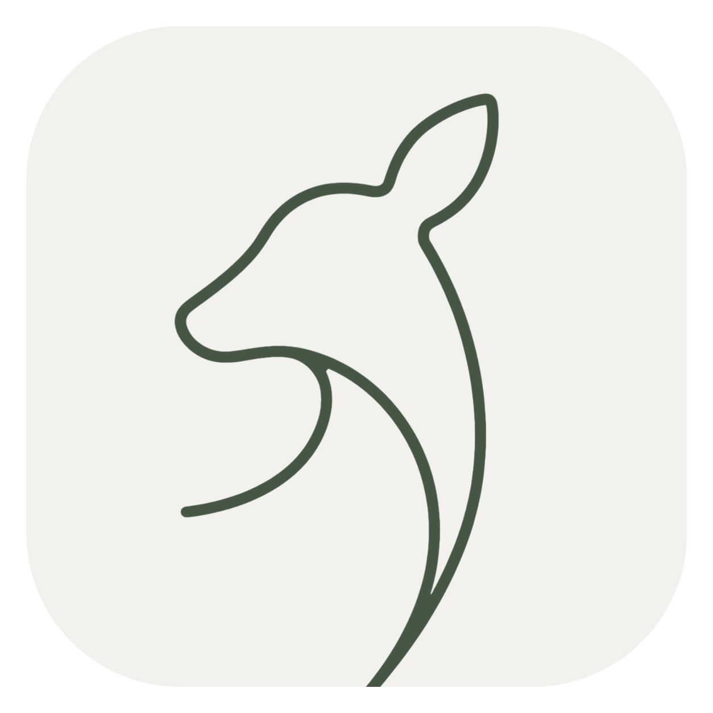

<p align="center">
  
</p>

<h1 align="center">Doe</h1>

<p align="center">
  <strong>Aesthetic. Local-first. Kanban sanctuary.</strong>
</p>

<p align="center">
  
  
  
  
  
  
</p>

<br>

> **Doe** — a desktop Kanban app for those who value aesthetics, privacy, and complete control over their data.
> No clouds, subscriptions, or sign-ups. Just you, your tasks, and a local database.

<br>

<p align="center">
  <a href="#-why-doe">Why Doe</a> ·
  <a href="#-quick-start">Quick Start</a> ·
  <a href="#-architecture">Architecture</a> ·
  <a href="#-features">Features</a> ·
  <a href="#-keyboard-shortcuts">Keyboard Shortcuts</a> ·
  <a href="#-development">Development</a>
</p>

---

## ✨ Why Doe?

<table>
<tr>
  <td width="50%">

### 🔒 100% Local
All data is stored in a `.db.doe` file on your computer. Want to put it in iCloud and sync between Macs? Go ahead. A USB stick? Works too. Nobody but you has access.

### 🎨 Aesthetics in Everything
Dark and light themes, custom fonts, smooth animations, thoughtful typography. The board looks as good as it works.

### 🧠 Local AI
Built-in AI assistant powered by **Gemma 4** — fully offline with Apple Silicon acceleration. Discuss tasks, search the board, create cards, remember facts between sessions.

### ⏱️ Built-in Time Tracker
Start a timer on a task — time is written to the database. The calendar shows your daily breakdown. Statistics sum up your week.

  </td>
  <td width="50%">

### 📝 Markdown Editor
Full-featured editor with live preview, collapsible headings, syntax highlighting (Prism.js), math (KaTeX), and drag-and-drop attachments.

### 🔗 Task Links
Many-to-many relationships: parent, child, dependent tasks. The relationship graph is visualized with D3.js.

### 🔁 Automations
Recurring cards on schedule (daily, weekly…), auto-sort columns, auto-cleanup of old tasks.

### 📊 Priorities
9-factor importance model: value, success chance, background burden, process pain, drag, reporting need, proactivity, serenity, harm.

### 🌍 Russian & English
Full UI localization in two languages. Switch on the fly.

  </td>
</tr>
</table>

---

## 🖼 Screenshots

<p align="center">
  <em>Screenshots coming soon. In the meantime — run it and see for yourself.</em>
</p>

---

## 🚀 Quick Start

### macOS (Apple Silicon)

```bash
# 1. Clone
git clone https://github.com/chr1stvoskrese/Doe.git
cd Doe

# 2. Create virtual environment
python3 -m venv venv
source venv/bin/activate

# 3. Install dependencies
pip install -r requirements.txt

# 4. Run
python wrapper.py
```

### Build

Single cross-platform builder with an interactive menu (works on both macOS and Windows):

```bash
python build.py
```

The script auto-detects your system and suggests targets: Apple Silicon (with AI), Intel (without AI, for older Macs), or both. The Intel environment is created automatically. Output: `dist/Doe.app` (arm64) and/or `dist-intel/Doe.app` (Intel).

Menu-less (for CI): `python build.py --target arm64|intel|both|windows`.

### Windows

```bat
:: 1. Clone and navigate
git clone https://github.com/chr1stvoskrese/Doe.git
cd Doe

:: 2. Virtual environment and dependencies
python -m venv venv
venv\Scripts\activate
pip install -r requirements.txt

:: 3. Run
python wrapper.py

:: 4. Build (.exe)
python build.py
```

> **Note:** The AI assistant (llama-cpp) only works on macOS arm64 with Apple Silicon.
> On Windows and Intel Macs, AI is unavailable — everything else works fully.

---

## 🧱 Architecture

```
┌─────────────────────────────────────────────┐
│          Desktop Window (pywebview)          │
│  ┌───────────────────────────────────────┐  │
│  │     index.html · app.js · styles.css  │  │
│  │     Vanilla JS · Fetch · WebSocket    │  │
│  └────────────────────┬──────────────────┘  │
│                       │ localhost:8000       │
└───────────────────────┼──────────────────────┘
                        │
┌───────────────────────┼──────────────────────┐
│          FastAPI Server (uvicorn)            │
│  ┌────────────────────┴──────────────────┐  │
│  │  /api/v1/columns                      │  │
│  │  /api/v1/tasks        CRUD + move     │  │
│  │  /api/v1/workspaces                   │  │
│  │  /api/v1/system       vault/settings  │  │
│  │  /api/v1/ai           local LLM       │  │
│  │  /api/v1/automations                  │  │
│  │  /api/v1/memory       spaced repetition│  │
│  └────────────────────┬──────────────────┘  │
│                       │                       │
│  ┌────────────────────┴──────────────────┐  │
│  │  SQLAlchemy 2.0 (async) + aiosqlite   │  │
│  │  Alembic migrations                   │  │
│  └────────────────────┬──────────────────┘  │
└───────────────────────┼──────────────────────┘
                        │
┌───────────────────────┴──────────────────────┐
│  doe.db.doe   +   doe/ (attachments)         │
│  or Obsidian-compatible folder (.md files)   │
│  storage folder on disk                      │
└─────────────────────────────────────────────┘
```

| Layer | Technology |
|---|---|
| **Runtime** | Python 3.12 · FastAPI 0.115 · Uvicorn |
| **Database** | SQLite (aiosqlite) · SQLAlchemy 2.0 (async) |
| **Migrations** | Alembic |
| **Desktop** | pywebview (native OS WebView) |
| **Build** | PyInstaller (`.app` / `.exe`) |
| **AI** | llama-cpp-python · Gemma 4 (Metal-accelerated) |
| **Frontend** | Vanilla JS (~17k lines) · CSS (~10k lines) · space.js (~1.7k) |
| **Storage** | SQLite (+aiosqlite) **and** Obsidian-compatible file store (FS Store v2) |
| **Editor** | CodeMirror · Marked.js · Prism.js · KaTeX |
| **Sync** | WebSocket · watchdog |
| **iOS** | Native SwiftUI app (iPad/iPhone) |

---

## 📦 Features

<details open>
<summary><strong>📋 Kanban Board</strong></summary>

- Unlimited workspaces (tabs) and columns
- Drag-and-drop cards between and within columns
- Three column modes: **Normal**, **Time Tracker**, **Close-out**
- Collapsible columns, adjustable width, keyboard shortcuts
- JSON export/import of the entire board or individual cards

</details>

<details>
<summary><strong>📝 Task Cards</strong></summary>

- Markdown description with live preview
- Checklists (subtasks) via many-to-many relations
- Deadlines with native macOS/Windows notifications
- Attachments: drag-and-drop, file picker, auto-cleanup of orphaned files
- Priorities: 9-factor model with visual indicators
- Time tracking: start/stop timer, accumulated time, manual adjustment

</details>

<details>
<summary><strong>🧩 Extensions (13 modules)</strong></summary>

| Module | Description |
|---|---|
| **Search** | Global search with boolean expressions (`&&`, `\|\|`) and tag search |
| **Calendar** | Day/week/month: deadlines and time blocks |
| **Reminders** | System notifications on schedule |
| **Graph** | Task relationship visualization (D3.js force-directed graph) |
| **Statistics** | Weekly analytics: trends, top tasks, daily breakdown |
| **AI Assistant** | Local LLM: chat, search, task creation, memory |
| **Automations** | Recurring cards, auto-sort, auto-cleanup |
| **Deadlines** | Overdue and upcoming deadlines |
| **Priorities** | Color labels and emoji for priorities |
| **Export** | Export cards to Markdown |
| **Tabs** | Switch between workspaces |
| **Space** | Infinite vector canvas (DoeSpace): drawing, text, connections |
| **Memory** | Spaced repetition (SRS, SM-2 algorithm) for facts and notes |

</details>

<details>
<summary><strong>🤖 AI Assistant</strong></summary>

Runs **fully offline** — local **Gemma 4** (Google), Apple Silicon with Metal acceleration and flash-attention (macOS arm64). Models are downloaded via HuggingFace:

| Model | Parameters | Size |
|---|---|---|
| Gemma 4 E2B | 2.3B | ~3.1 GB |
| Gemma 4 E4B | 4.5B | ~4.8 GB |
| Gemma 4 12B | 12B | ~6.5 GB |
| Gemma 4 26B (A4B MoE) | 26B | ~13.5 GB |

- **Can:** search the board, create/edit/delete tasks, move cards, create columns and workspaces, change theme and language, toggle extensions, prioritize tasks, set reminders
- **Memory:** remembers facts between sessions (`~/.doe_app/memory/`)

</details>

<details>
<summary><strong>⚙️ Settings</strong></summary>

- Theme: light / dark (CSS variables)
- Language: Russian / English
- Custom fonts: system picker or `.ttf` / `.woff2` from storage
- Attachment storage: inside vault or global folder
- Priorities: configure thresholds, colors, and emoji

</details>

---

## ⌨ Keyboard Shortcuts

| Keys | Action |
|---|---|
| `Cmd/Ctrl + F` | Search — across the board or within an open card |
| `Cmd/Ctrl + \` | Collapse / expand tabs |
| `Esc` | Close modal / cancel editing |

---

## 🛠 Development

```bash
# Alembic migrations
alembic revision --autogenerate -m "description"
alembic upgrade head
alembic downgrade -1
```

```
# Project structure
src/
├── api/v1/          # FastAPI routers (columns, tasks, workspaces, system, ai, automations, memory)
├── core/            # config, watcher, vault_crypto, biometric, fs_store (Obsidian-vault), attach_jobs
├── db/              # database.py, models.py
├── services/        # task_service, column_service, workspace_service, ai_service, automation_service, memory_service, srs, hardware
└── schemas/         # Pydantic DTOs (task, column, workspace, automation)
frontend/
├── index.html       # entry point (~1.9k lines)
├── app.js           # all logic (~17k lines)
├── styles.css       # styles (~10k lines)
└── space.js         # «Space» extension (~1.7k lines)
iOS/                 # native SwiftUI app (iPad/iPhone)
wrapper.py           # entry point, window management
main.py              # FastAPI application
notify_worker.py     # background notification worker
build.py             # cross-platform builder
rewrite.py           # AI-powered refactoring via git
gather_context.py    # code context collector for AI dialogues
dev_stats.py         # development statistics
run_ios.py           # build and run iOS version
make_dmg.sh          # DMG image builder
```

---

<p align="center">
  <sub>Crafted with love for detail. Your data is yours. Privacy is absolute.</sub>
</p>
